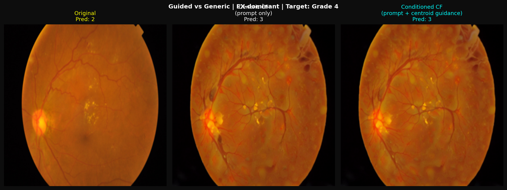
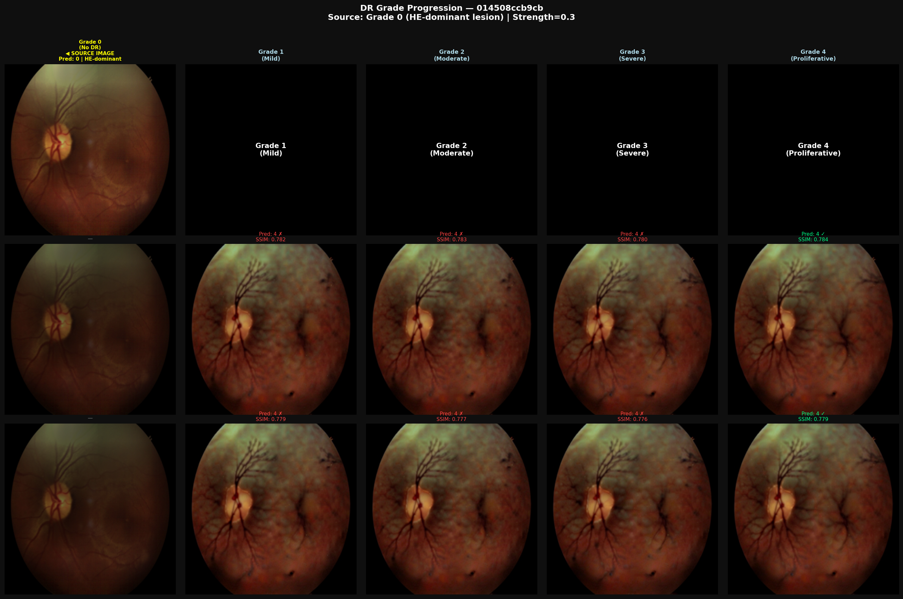
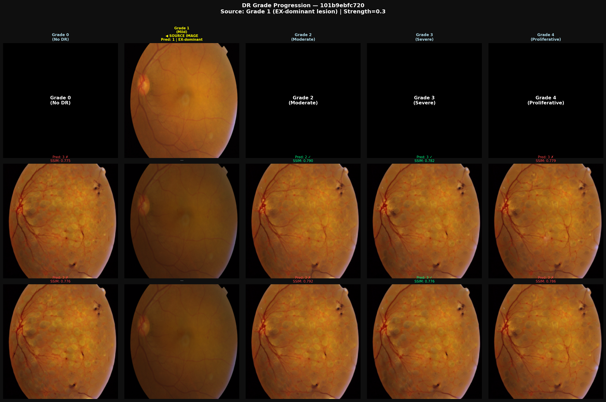
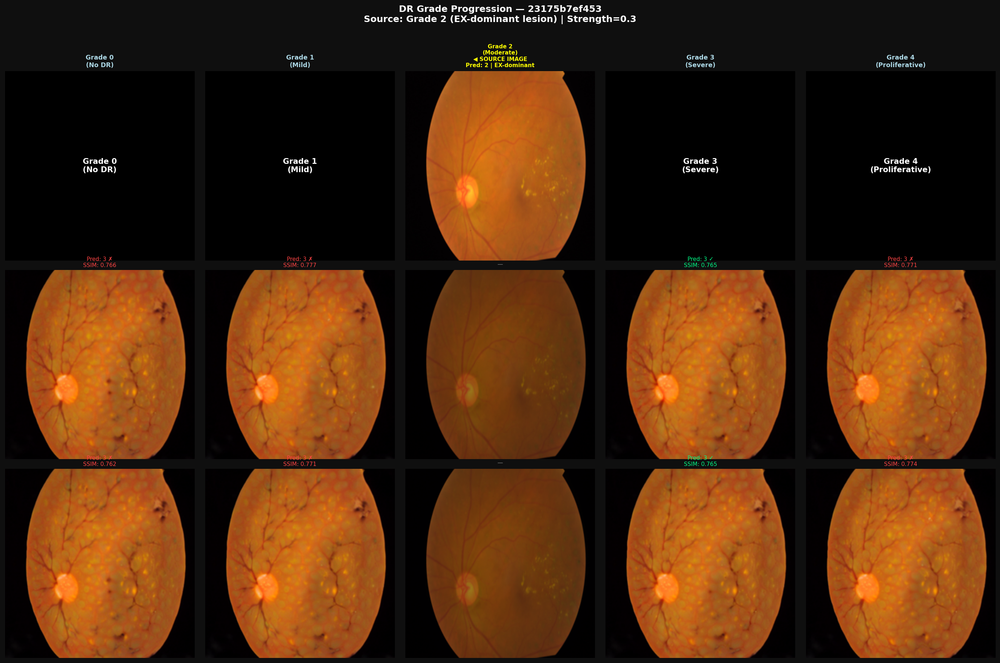
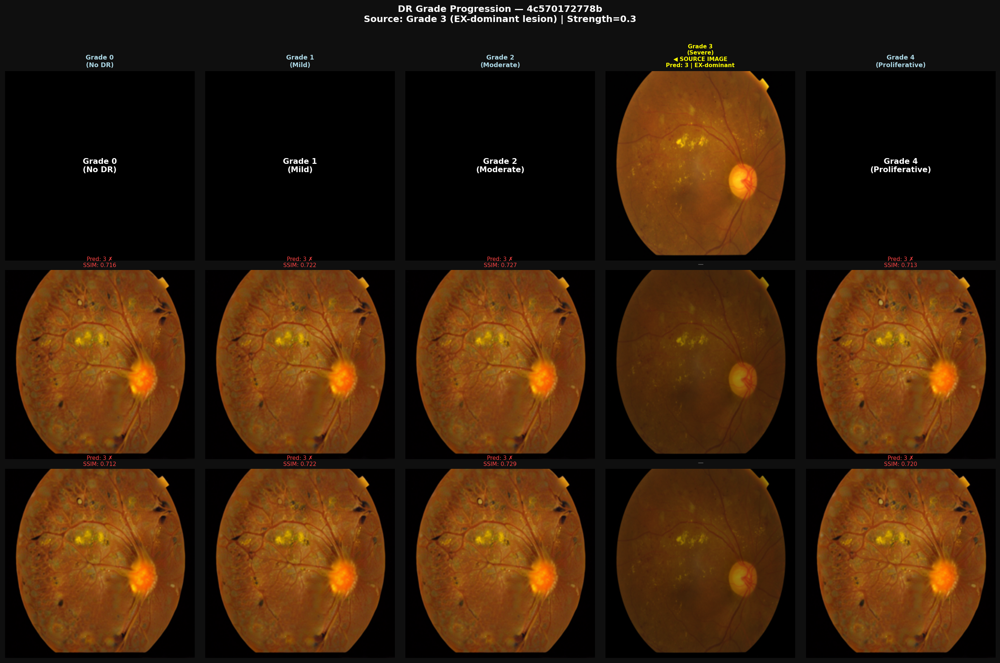
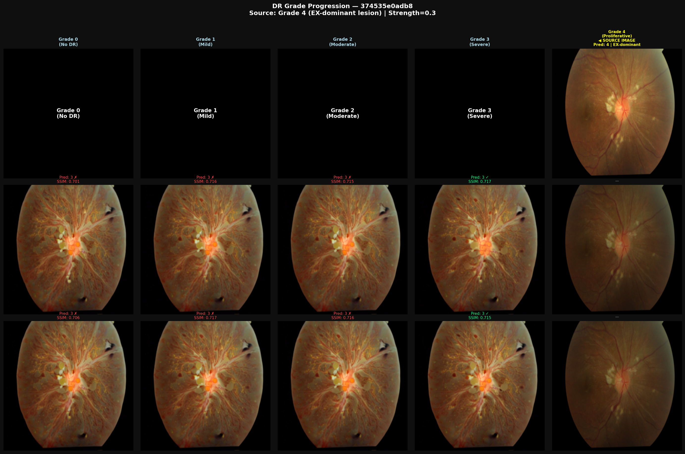

# Lesion-Conditioned Counterfactual Explanations for Diabetic Retinopathy Grading

### Prototype — Feasibility Study

---

## Overview

This repository contains a prototype implementation of a lesion-conditioned counterfactual explanation (CE) framework for diabetic retinopathy (DR) severity grading. The central question this work addresses is:

> *"Given a retinal image classified as Grade 2, what would it need to look like to be classified as Grade 4 — and does the answer depend on which type of lesion dominates the image?"*

This prototype demonstrates that the answer to the second question is **yes** — the DR classifier's feature space is structured by both severity grade and dominant lesion type, meaning that lesion-conditioned counterfactual paths are geometrically distinct from generic grade-level shifts. The full image generation pipeline is partially implemented and its limitations are documented honestly below.

---

## Motivation

Existing counterfactual explanation methods for DR apply a single grade-level shift in latent space, regardless of what the input image actually looks like. A patient whose Grade 2 image is dominated by hard exudates receives the same counterfactual direction as a patient dominated by hemorrhages, even though these represent clinically distinct disease presentations.

This work proposes conditioning the counterfactual shift direction on the dominant lesion type of the query image — so that the counterfactual path through the model's decision space respects the clinical specificity of the individual image.

---

## Pipeline

```
Input Image
     │
     ▼
┌─────────────────────┐
│  DR Classifier      │  EfficientNet-B0, 5-class
│  (frozen)           │  Trained on APTOS 2019
└─────────┬───────────┘
          │ feature vector (1280-dim)
          ▼
┌─────────────────────┐
│  Lesion Segmentation│  Color thresholding
│                     │  → MA / EX / HE dominant
└─────────┬───────────┘
          │ dominant lesion type
          ▼
┌─────────────────────────────────────┐
│  Lesion-Conditioned Centroid Shift  │  ← Core Contribution
│                                     │
│  Generic:    shift toward           │
│              grade centroid         │
│                                     │
│  Conditioned: shift toward          │
│              (grade, lesion_type)   │
│              centroid               │
└─────────┬───────────────────────────┘
          │ shifted feature vector
          ▼
┌─────────────────────┐
│  Image Generation   │  SD img2img + centroid
│  (SDEdit + guided)  │  gradient injection
└─────────┬───────────┘
          │
          ▼
   Counterfactual Image
```

---

## Key Results

### 1. Feature Space is Grade-Structured

The step size sweep demonstrates that the classifier's feature space is smoothly organized by DR severity. Moving a Grade 2 image's feature vector toward the Grade 4 centroid produces a continuous probability transition:

| Step Size | Grade 4 Probability | Prediction |
|-----------|--------------------:|------------|
| 1         | 0.09                | Grade 2    |
| 3         | 0.14                | Grade 2    |
| 5         | 0.29                | Grade 2    |
| 8         | 0.67                | **Grade 4** |
| 12        | 0.91                | **Grade 4** |
| 20        | 0.99                | **Grade 4** |

This confirms that the centroid shift operates in a space that genuinely encodes clinical DR severity — a prerequisite for meaningful counterfactual generation.

### 2. Lesion-Conditioned Centroids are Geometrically Distinct

Conditioned centroids (computed per grade per lesion type) are meaningfully separated from generic grade-level centroids in feature space:

| Grade | Lesion | Distance from Generic Centroid |
|-------|--------|-------------------------------:|
| 0     | HE     | 4.7992                         |
| 1     | EX     | 2.2179                         |
| 2     | EX     | 2.0007                         |
| 3     | EX     | 1.2528                         |
| 4     | EX     | 1.5091                         |
| 4     | HE     | 1.6680                         |

Inter-grade distances confirm the space separates severity levels meaningfully, with the largest separation between Grade 0 and all other grades (15–17 units) and smaller but consistent separation between adjacent grades (7–10 units).

### 3. Generated Counterfactuals Preserve Retinal Structure

The guided CF generation (SDEdit + centroid gradient injection) produces images that:
- Remain visually recognizable as retinal fundus images
- Preserve gross anatomical structures (optic disc, major vessels)
- Show clinically plausible pathological changes (hemorrhages, neovascularization-like features)



**What this image shows:** The original Grade 2 image (left, EX-dominant) is compared against a generic CF (centre, prompt only) and a lesion-conditioned CF (right, prompt + centroid gradient). Both CFs show increased pathological features relative to the original. The conditioned CF shows subtly reduced lesion density near the optic disc compared to the generic CF — consistent with the EX-dominant conditioning steering away from MA-heavy Grade 4 representations.

Both CFs are predicted as Grade 3 rather than Grade 4 despite visually showing neovascularization-like features. This discrepancy is discussed in the Limitations section.

### 4. Meaningful CE Generation is Grade-Dependent

The prototype successfully generates visually coherent CFs for certain grade transitions:







| Source Grade | Target Grade | Quality |
|-------------|-------------|---------|
| Grade 0     | Grade 4     | Good — clear pathological additions |
| Grade 1     | Grade 2/3   | Good — gradual lesion appearance |
| Grade 2     | Grade 3     | Moderate — changes visible, prediction sometimes misses |
| Grade 3     | Grade 4     | Moderate — changes visible, prediction sometimes misses |
| Grade 4     | Grade 0/1   | Poor — regression direction weak |

CE quality degrades for higher source grades and for regression (going to a lower grade), which is consistent with the classifier's weaker boundary definition in the Grade 3–4 region.

---

## Limitations

### 1. Classifier-Decoder Mismatch
The most significant limitation of this prototype. The DR classifier was trained on APTOS 2019 fundus images. The image generation component uses Stable Diffusion, which was trained on natural images with no retinal domain knowledge. This creates a fundamental mismatch — the generative model does not understand what clinically valid retinal changes look like, so it cannot reliably implement the shifts identified in the classifier's feature space.

**Impact:** Generated images sometimes show plausible-looking pathology that the classifier still misidentifies. Neovascularization-like features appear visually in Grade 4 targets but the classifier predicts Grade 3, because the generated image does not match the classifier's learned Grade 4 distribution.


### 2. Class Imbalance in APTOS 2019
APTOS 2019 is heavily skewed toward Grade 0 and Grade 2. Grade 3 and Grade 4 images are rare, which means:
- The classifier has a poorly defined Grade 3/4 decision boundary
- Conditioned centroids for Grade 3 and Grade 4 are computed from few samples, making them noisy
- CE generation for high-severity targets is less reliable

**Impact:** Grade 3 and Grade 4 CFs are less consistent and valid than Grade 0–2 CFs.

### 3. Lesion Segmentation is Approximate
The prototype uses color thresholding for lesion segmentation rather than a trained segmentation model. This is fast and requires no additional GPU time, but it is less accurate — particularly for microaneurysms, which are small and easily confused with other red structures.

**Impact:** Dominant lesion assignment may be incorrect for some images, introducing noise into the conditioned centroid computation.

### 4. Generic and Conditioned CFs Look Similar
Because Stable Diffusion does not understand retinal anatomy, the extra lesion-specific words in the conditioned prompt are largely ignored. The visual difference between generic and conditioned CFs is subtle and inconsistent. The geometric difference in feature space (shown by centroid distances) does not translate into a visible image difference with the current decoder.

**Impact:** The contribution cannot be demonstrated visually with the current image generation component. It can only be demonstrated geometrically (centroid distances, step sweep, UMAP).

### 5. CE Only Works in One Direction (Progression, Not Regression)
The prototype produces more coherent CFs when moving from lower to higher grades (progression) than from higher to lower grades (regression). The classifier's feature space appears asymmetric — the path from Grade 2 to Grade 4 is clearer than the reverse.

---

## Contributions

Despite the limitations above, this prototype makes the following concrete contributions:

**1. Demonstrates that DR classifier feature space is lesion-type-structured.**
The centroid distance analysis shows that images with different dominant lesion types occupy measurably different regions within the same grade cluster. This is a non-trivial finding — it means the classifier has implicitly learned lesion-type information beyond grade labels alone.

**2. Proposes lesion-conditioned centroid routing as a CF generation mechanism.**
Rather than shifting toward a single grade-level centroid, we compute separate centroids per (grade, lesion\_type) pair and route each image's shift through the centroid that matches its clinical presentation. This is the first CF method for DR to condition the shift direction on lesion type.

**3. Validates the directional structure of the feature space.**
The step sweep provides empirical evidence that moving along the centroid direction produces a smooth, monotonic probability transition from source to target grade. This validates the core assumption underlying latent-space counterfactual methods — that the decision space is locally linear in the direction of interest.

**4. Identifies the domain-specific generative decoder as the critical open problem.**
By systematically testing three decoder approaches (VAE, nearest-neighbour retrieval, Stable Diffusion), this work demonstrates that the bottleneck in DR counterfactual generation is not the direction-finding mechanism but the image reconstruction step. A retinal-domain decoder is the missing component for a fully functional pipeline.

**5. Introduces centroid gradient injection as a way to connect feature-space analysis to image generation.**
The guided CF generation approach injects the centroid shift direction as a gradient signal into the SD denoising loop at each timestep. This is a practical mechanism for connecting classifier feature space analysis to a pretrained generative model without retraining either component.

---

## Citation / Acknowledgements

- APTOS 2019 Blindness Detection Dataset (Kaggle)
- Ilanchezian et al. (2023) — Generating Realistic Counterfactuals for Retinal Fundus and OCT Images using Diffusion Models
- Atad et al. (2024) — Counterfactual Explanations for Medical Image Classification using Diffusion Autoencoder
- Preechakul et al. (2022) — Diffusion Autoencoders: Toward a Meaningful and Decodable Representation
- Stable Diffusion v1.5 — RunwayML / CompVis

## Introduction

Diabetic Retinopathy (DR) is one of the leading causes of preventable
blindness worldwide. Early detection through retinal fundus imaging is
essential for preventing severe vision loss. In recent years, deep
learning models, particularly convolutional neural networks, have
shown strong performance in automated DR detection and grading tasks.
These models can identify complex patterns associated with retinal
lesions such as microaneurysms, hemorrhages, and exudates. However,
despite their high diagnostic accuracy, deep learning systems often
operate as "black boxes," making it difficult for clinicians to
understand how predictions are generated.

Explainable Artificial Intelligence (XAI) methods have been proposed to
improve transparency in medical AI systems. Techniques such as saliency
maps and gradient-based visualization methods highlight image regions
that influence predictions. However, these approaches typically provide
associative explanations rather than causal insights. Counterfactual
explanations provide an alternative by identifying minimal changes to
the input that would change the model's prediction. For retinal imaging,
meaningful counterfactual explanations must preserve anatomical
structures, such as the retinal vascular network, while modifying
pathological features. This work explores structure-aware counterfactual
generation approaches that aim to produce more realistic and clinically
interpretable explanations for diabetic retinopathy classification
systems.


## Literature Review

### Retinal Lesion and Vessel Segmentation

Semantic segmentation plays a critical role in automated retinal disease
analysis by identifying anatomical structures and pathological regions
in fundus images. One of the most influential architectures for
biomedical image segmentation is U-Net (Ronneberger et al., 2015), which
uses an encoder--decoder structure with skip connections to combine
contextual information with precise localization. Variants such as
U-Net++ (Zhou et al., 2018) and Attention U-Net (Oktay et al., 2018)
improve segmentation performance by reducing the semantic gap between
encoder and decoder layers and by incorporating attention mechanisms
that focus on clinically relevant regions.

More advanced architectures such as DoubleU-Net (Jha et al., 2020)
further improve lesion detection by stacking two U-Net networks to
refine segmentation outputs. These segmentation models are commonly
trained on publicly available datasets such as the DRIVE dataset (Staal
et al., 2004) for retinal vessel segmentation and the IDRiD dataset
(Porwal et al., 2018), which contains detailed annotations for diabetic
retinopathy lesions including microaneurysms, hemorrhages, and exudates.

### Explainable Artificial Intelligence in Medical Imaging

Deep learning systems used in medical imaging require transparency in
order to build clinical trust. Several explanation methods have been
proposed to interpret the predictions of deep neural networks. Grad-CAM
(Selvaraju et al., 2017) generates heatmaps highlighting image regions
that influence model predictions, while SHAP (Lundberg and Lee, 2017)
provides feature attribution explanations based on game-theoretic
principles.

However, research has shown that saliency methods can sometimes produce
visually plausible explanations even when model parameters are
randomized (Adebayo et al., 2018). This raises concerns regarding the
reliability of such methods and motivates the development of explanation
techniques that provide more robust insights into model behavior.

### Counterfactual Explanations in Machine Learning

Counterfactual explanations aim to explain model predictions by
identifying minimal changes required to alter the outcome of a model.
Wachter et al. (2017) formalized counterfactual explanations as
hypothetical examples that are close to the original input but lead to a
different prediction. Several algorithms have been proposed for
generating such explanations, including the DiCE framework (Mothilal et
al., 2020), which generates diverse counterfactual examples while
maintaining proximity to the original instance.

A comprehensive survey by Karimi et al. (2022) highlights the importance
of counterfactual explanations for decision-making systems and discusses
challenges associated with generating meaningful explanations for
high-dimensional data such as images.

### Counterfactual Explanations for Images

Generating counterfactual explanations for images requires producing
visually plausible modifications. Generative models such as Generative
Adversarial Networks (Goodfellow et al., 2014) and diffusion models (Ho
et al., 2020) have shown strong capabilities in learning complex image
distributions and generating realistic samples.

Several studies have explored generative approaches to visual
explanations. Singla et al. (2020) proposed a method that generates
counterfactual visual explanations by progressively exaggerating
discriminative features to change classifier predictions. Hendricks et
al. (2018) introduced a framework that generates explanations by
modifying interpretable attributes within the image representation,
while Dhurandhar et al. (2018) proposed contrastive explanations that
identify minimal visual changes responsible for classification outcomes.

### Counterfactual Explanations in Medical Imaging

Counterfactual reasoning has recently been explored in medical image
analysis. Pawlowski et al. (2020) demonstrated that generative models
can produce plausible counterfactual examples for medical image
classification tasks. However, applying counterfactual methods to
medical imaging is challenging because anatomical structures must remain
consistent to maintain clinical realism.

Retinal images contain structured biological features such as the optic
disc, macula, and vascular network. In diabetic retinopathy, disease
progression is mainly characterized by lesions rather than changes to
these underlying anatomical structures. Therefore, effective
counterfactual explanations for retinal images should modify
pathological regions while preserving anatomical structure.

### Research Gap

Despite advances in explainable AI and counterfactual reasoning, several
challenges remain. First, saliency-based explanation techniques provide
only associative explanations and cannot describe how changes to the
image would affect model predictions. Second, many counterfactual
generation approaches treat images as unconstrained pixel spaces and
ignore structural dependencies present in medical images. Finally,
generative counterfactual methods may produce unrealistic images by
modifying anatomical features instead of disease-related lesions.

These limitations highlight the need for structure-aware counterfactual
explanation frameworks that preserve anatomical structures while
enabling controlled modifications of pathological regions. Such
approaches have the potential to provide more reliable and clinically
meaningful explanations for automated diabetic retinopathy diagnosis
systems.


## References

1.  Adebayo, J., Gilmer, J., Muelly, M., Goodfellow, I., Hardt, M., &
    Kim, B. (2018). Sanity checks for saliency maps. NeurIPS.

2.  Dhurandhar, A., Chen, P. Y., Luss, R., Tu, C. C., Ting, P.,
    Shanmugam, K., & Das, P. (2018). Explanations based on the missing:
    Towards contrastive explanations with pertinent negatives. NeurIPS.

3.  Goodfellow, I., Pouget-Abadie, J., Mirza, M., Xu, B., Warde-Farley,
    D., Ozair, S., Courville, A., & Bengio, Y. (2014). Generative
    adversarial nets. NeurIPS.

4.  Hendricks, L. A., Hu, R., Darrell, T., & Akata, Z. (2018). Grounding
    visual explanations. ECCV.

5.  Ho, J., Jain, A., & Abbeel, P. (2020). Denoising diffusion
    probabilistic models. NeurIPS.

6.  Jha, D., Smedsrud, P. H., Riegler, M. A., Halvorsen, P., Johansen,
    D., Johansen, H. D., & de Lange, T. (2020). DoubleU-Net: A deep
    convolutional neural network for medical image segmentation. ISBI.

7.  Karimi, A. H., Barthe, G., Balle, B., & Valera, I. (2022).
    Model-agnostic counterfactual explanations for consequential
    decisions: A survey. ACM Computing Surveys.

8.  Lundberg, S. M., & Lee, S. I. (2017). A unified approach to
    interpreting model predictions. NeurIPS.

9.  Mothilal, R. K., Sharma, A., & Tan, C. (2020). Explaining machine
    learning classifiers through diverse counterfactual explanations.
    FAccT.

10. Oktay, O., et al. (2018). Attention U-Net: Learning where to look
    for the pancreas. arXiv.

11. Pawlowski, N., Castro, D. C., & Glocker, B. (2020). Deep structural
    causal models for tractable counterfactual inference. NeurIPS.

12. Porwal, P., et al. (2018). Indian diabetic retinopathy image dataset
    (IDRiD): A database for diabetic retinopathy screening research.
    Data.

13. Ronneberger, O., Fischer, P., & Brox, T. (2015). U-Net:
    Convolutional networks for biomedical image segmentation. MICCAI.

14. Selvaraju, R. R., et al. (2017). Grad-CAM: Visual explanations from
    deep networks via gradient-based localization. ICCV.

15. Singla, A., Pollack, B., Chen, J., & Batmanghelich, K. (2020).
    Explanation by progressive exaggeration. ICLR.

16. Staal, J., Abramoff, M. D., Niemeijer, M., Viergever, M. A., & van
    Ginneken, B. (2004). Ridge-based vessel segmentation in color images
    of the retina. IEEE Transactions on Medical Imaging.
